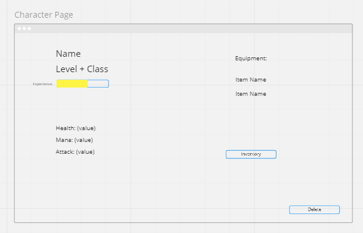

# Project-4-RPG

Creating a simple rpg, name still pending.  Users will be able to create characters(one-to-many) and characters can obtain different items as they battle monsters(many-to-many)

## User Stoies

* As a user I want to sign up for an account and create different characters of different classes.
* As a user I want to equip my character with different pieces of gear to help in combat.
* As a user I want to fight monsters to get experience and level up as well as aquire loot.
* As a user I want to sell loot I dont need for gold.
* As a user I want to  be able to purchase gear for gold.

## ERD

## Wireframes

### Sign In

### Sign Up

### Character Select

### Character Page

### Inventory

### Monster List

### Battle Page

